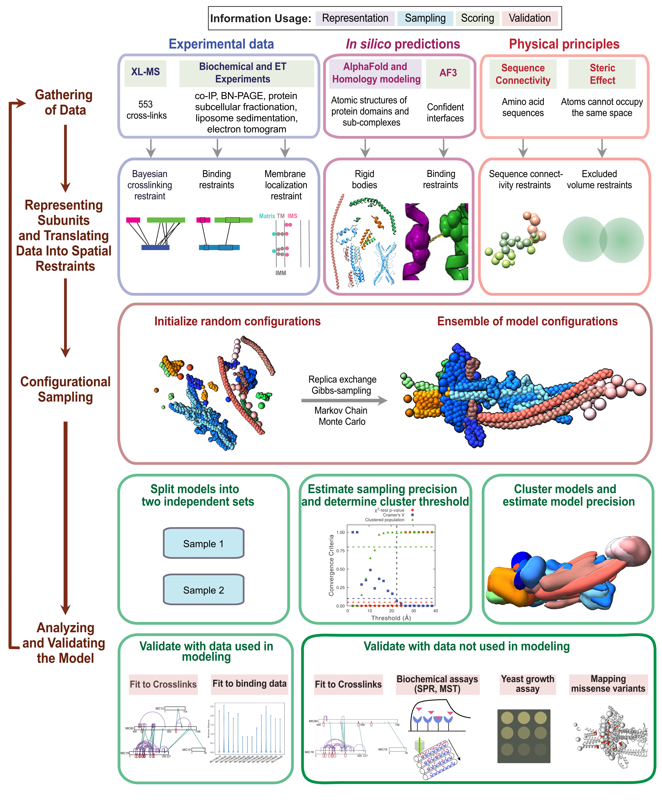

[](https://doi.org/10.5281/zenodo.18383758)

# Mitochondrial contact site and cristae organizing system (MICOS)
This repository is of the integrative model of the MICOS complex based on data from XLMS, biochemical assays, ET,  AF predictions, homology modeling, sequence alignments, and stereochemistry information. It contains input data, scripts for modeling and results including bead models and localization probability density maps. The modeling was performed using IMP (Integrative Modeling Platform).


## Depositions in PDB and ModelArchive
PDB entry for the integrative model: TBD

Model archive entries for Alphafold3 models: TBD



## Directory structure
1. [inputs](inputs/) : Contains the subdirectories for the preprocessing steps for the crosslinks and biochemical data and input data used for modeling.
2. [scripts](scripts/) : Contains all the scripts used for modeling and analysis of the models.
3. [modeling](modeling/) : Contains the subdirectories for bild files used for visualization of the models and the custom IMP module for membrane restraints.

## Protocol

### Preprocessing

1. In case of AlphaFold2 predicted structures only regions of high confidence (>70 pLDDT and <5 PAE) are used. Following script extracts regions of high confidence:

```
scripts/preprocessing/get_high_confidence_region_from_AF2.py
```

2. In case of AlphaFold3 predicted structures, rigid bodies and confidently predicted interfaces are obtained using [af_pipeline](https://github.com/isblab/af_pipeline). See the [wrapper script](scripts/preprocessing/af3_micos.py) for this.

The AF3 input JSON files are stored in `inputs/data/AF3` for homo-oligomers, hetero-oligomers, and higher-order oliogmers. The AF3 output, confident rigid bodies, and interacting patches are deposited in [Zenodo](https://doi.org/10.5281/zenodo.18383758). 


3. Crosslinks from all the paralogs (mouse, yeast) were mapped to human proteins using the scripts in `inputs/preprocessing/crosslinks_biochemical/scripts` directory. See [details](inputs/preprocessing/crosslinks_biochemical/README.md).


### Sampling

1. Compile IMP with the custom Desmosome module (scripts/modeling/custom_module). See the instructions for compilation in the [official guide](https://integrativemodeling.org/nightly/doc/manual/installation.html).

2. To perform production runs, run the following script:

```
scripts/modeling/production_runs.sh
```

### Analysis

1. Getting the good-scoring models

Good-scoring models were selected using pmi_analysis (Please refer to [pmi_analysis tutorial](https://github.com/salilab/PMI_analysis) for more detailed explanation) along with our `variable_filter_v1.py` script.

Following are the scripts used:

- `scripts/analysis/sampcon/run_analysis_trajectories.py`

- `scripts/analysis/sampcon/variable_filter_v1.py` on the major cluster if the number of models exceeds 30000.

- The selected good-scoring models were then extracted using `scripts/analysis/sampcon/run_extract_models.py`.


2. Running the sampling exhaustiveness tests (Sampcon)

A `density.txt` file is created, containing the details of the domains to be split for visualizing the localization probability densities. See `results/sampcon/density.txt` for more details.

Finally, sampling exhaustiveness tests were performed using `imp-sampcon`. Run:

```
scripts/analysis/sampcon/sampcon.sh
```


3. Analysing the major cluster

- Extract the frames of the major cluster using `scripts/analysis/post_sampcon/extract_sampcon.py` script.

- Assess the fit to the input biochemical data using `scripts/analysis/post_sampcon/fit_to_binding_data.py` script.

- Compute crosslink violations using `scripts/analysis/post_sampcon/get_xl_viol_validation_set_v2.py` script. We used all (52) the crosslinks from [Zhu 2024](???), stored in `inputs/data/crosslinks/evicalc_DHSO_DSSO_human.csv` for validation. **Note:** This CSV file also contains 7 crosslinks from other datasets.

- Create contact maps for the protein pairs using `scripts/analysis/post_sampcon/contact_maps_surface_v2.py` script. The proteins to be considered are specified as lists protein1 and protein2. 

- Obtain domainwise precision using [PrISM](https://doi.org/10.1093/bioinformatics/btac400).

You can use the following script to do all the above steps:

```
scripts/analysis/post_sampcon/xl_prism_cm_fit.sh
```

- Mapped ClinVar missense variants, predicted to be likely pathogenic by AlphaMissense using `scripts/analysis/mutations/micos_clinvar_mutations.py` script.

Note: You can also find these scripts in [IMP_Toolbox](https://github.com/isblab/IMP_Toolbox).


### Results

For the simulations, the results directory contains: 

- `contact_maps` : Directory containing of the contact map for each protein pair in the MICOS complex.
- `sampcon` : Directory containing sampcon output for the largest cluster.
- `prism` : Directory containing the PrISM output.
- `xl_violations` : Directory containing the logs for crosslink violations.
- `ccm_pdb_aligned` : Directory containing input structures aligned to the cluster center bead model for visualization.
- `mutations`: Directory containing the ClinVar mutations and AlphaMissense annotations for pathogenicity.

Additional data is uploaded in Zenodo (the set of major cluster models corresponding to the main modeling run presented in the paper).
 
## Information
**Author(s):** Muskaan Jindal, Rakesh Mahato, Arko Guha, Sreemoyee Das, Kartik Majila, Shreyas Arvindekar, Anand Vaidya, Shruthi Viswanath\
**Date:** 15th April 2026 \
**License:** [CC BY-SA 4.0](https://creativecommons.org/licenses/by-sa/4.0/)
This work is licensed under the Creative Commons Attribution-ShareAlike 4.0
International License.\
**Publications:** 
